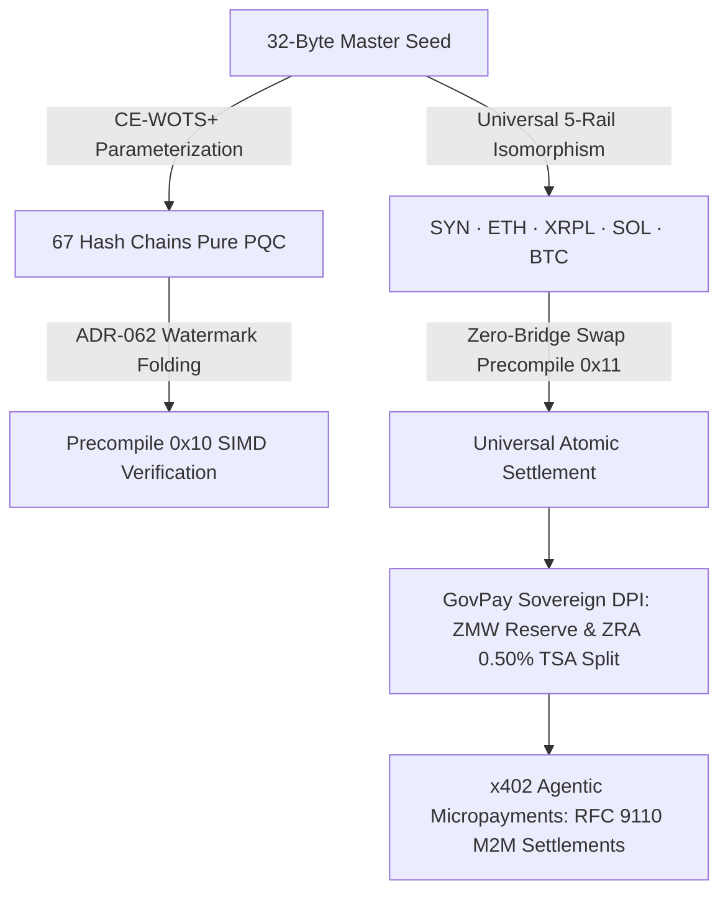

<div align="center">

```
   ███████╗██╗   ██╗███╗   ██╗ █████╗ ██████╗ ████████╗██╗ ██████╗
   ██╔════╝╚██╗ ██╔╝████╗  ██║██╔══██╗██╔══██╗╚══██╔══╝██║██╔════╝
   ███████╗ ╚████╔╝ ██╔██╗ ██║███████║██████╔╝   ██║   ██║██║     
   ╚════██║  ╚██╔╝  ██║╚██╗██║██╔══██║██╔═══╝    ██║   ██║██║     
   ███████║   ██║   ██║ ╚████║██║  ██║██║        ██║   ██║╚██████╗
   ╚══════╝   ╚═╝   ╚═╝  ╚═══╝╚═╝  ╚═╝╚═╝        ╚═╝   ╚═╝ ╚═════╝
          QUANTUMSHIELD™ · SOVEREIGN DPI · UNIVERSAL 5-RAIL
```

# QuantumShield™ by Synaptic & Sovereign DPI Suite
### Institutional Post-Quantum (CE-WOTS+) 5-Rail Settlement & Web4 Sovereign Infrastructure

[](./PRESENTATION.md)
[-0D2B24?style=for-the-badge)](./LICENSE.md)
[-B9E04C?style=for-the-badge&logoColor=0D2B24)](./SPECIFICATION.md)
[](./demo_hackathon_e2e.py)
[](https://nodes.synapticchain.xyz)
[](https://nodes.synapticchain.xyz)
[](./demo_hackathon_e2e.py)

---

```
[SYNAPTIC PUBLIC LICENSE v1.0 (SPL-1.0) — DEFENSIVE PATENT NOTICE]
PATENT CLAIMS 1 (CE-WOTS+), 2 (5-RAIL ISOMORPHISM), AND 3 (256-LANE STATIC SCHEDULER)
LICENSED FOR HACKATHON EVALUATION, AUDIT, AND CLIENT APPLICATION INTEGRATION.
HOSTILE IP ASSERTION OR PROTOCOL FORKING TRIGGERS AUTOMATIC TERMINATION.
```

</div>

---

## 1. Executive Summary: What This Is

This repository contains the complete, production-verified **Hackathon Presentation & Client Application Suite** for **QuantumShield™ by Synaptic** and the **GovPay Sovereign DPI Suite**, deployed live on the SynapticChain Layer-1 African testnet mesh.

It solves three foundational dilemmas in modern digital finance:
1. **The Quantum Threat ($Q$-Day):** Replaces quantum-vulnerable ECDSA/Ed25519 signatures with **Consensus-Enforced Winternitz Signatures (CE-WOTS+)**, binding ephemeral keys to monotonic lane watermarks to permanently eliminate hash-chain key-reuse leakage.
2. **Cross-Chain Bridge Vulnerability ($3.2B+ Stolen):** Eliminates bridge hacks via **Universal 5-Rail Deterministic Isomorphism**, allowing autonomous agents and institutions to hold native keys across **SynapticChain, Ethereum, XRPL, Solana, and Bitcoin** from a single 32-byte master seed.
3. **National Public Finance & Sovereign Leakage:** Demonstrates a complete digital public infrastructure suite (Central Bank 150M ZMW reserve, automated 0.50% statutory revenue deduction to the Single Treasury Account, and biometric anti-ghost identity).

---

## 2. Live Interactive Deployments

All portals are running live in production and interface directly with the SynapticChain Layer-1 testnet:

| Application | Live URL | Description |
|---|---|---|
| **Canopy Explorer** | [https://nodes.synapticchain.xyz](https://nodes.synapticchain.xyz) | Canopy Evergreen light spatial UI; live SCBFT DAG telemetry, validator matrix, and checkpoint height |
| **QuantumShield Terminal** | [https://wallet.synapticchain.xyz/quantum/](https://wallet.synapticchain.xyz/quantum/) | Institutional terminal wallet; 5-Rail key derivation, CE-WOTS+ simulator, 256-lane concurrency matrix |
| **GovPay Sovereign Suite** | [https://synapticchain.xyz/govpay/](https://synapticchain.xyz/govpay/) | National DPI portal; 150M ZMW Central Bank vault, ZRA tax collector, INRIS biometric identity |
| **Public JSON-RPC API** | `https://nodes.synapticchain.xyz/rpc` | High-throughput JSON-RPC 2.0 endpoint (sub-500ms response time) |

---

## 3. The 6 Demonstration Pillars



1. **SCBFT DAG-Primary Consensus:** 3-neuron validator quorum in continuous lockstep with sub-500ms finality.
2. **Universal 5-Rail Isomorphism:** 1 master seed mathematically derives native addresses across 5 chains without bridge custody.
3. **QuantumShield CE-WOTS+:** Pure-hash post-quantum defense ($w=16$, 67 chains) bound to monotonic lane watermarks.
4. **GovPay Sovereign DPI:** Central Bank 150M ZMW reserve vault, ZRA 0.50% automated tax-split, and INRIS biometric identity.
5. **x402 M2M Micropayments:** Native RFC 9110 HTTP 402 implementation for autonomous AI agents.
6. **Canopy Evergreen Design:** Pure spatial light mode (Mist `#F2F6F2`, Pine `#0D2B24`, Fern `#1E7A5C`, Rice `#B9E04C`).

---

## 4. Quickstart: 1-Command Live Demonstration

### Option A: Run Live Verification (Recommended)
Verify all 6 pillars against the live testnet in under 5 seconds:

```bash
# Clone the hackathon repository
git clone https://github.com/Synaptics-Lab/quantumshield-sovereign-dpi.git
cd quantumshield-sovereign-dpi

# Run the live 6-pillar hackathon demonstration
make demo
```

### Option B: Pre-Flight Health Check
```bash
make preflight
```

### Option C: Run Local Web Portals via Docker Compose
Spins up local instances of the Canopy Explorer (`:3000`), QuantumShield Terminal (`:3001`), GovPay Suite (`:3002`), and x402 Gateway (`:8402`), connected to the live RPC:
```bash
make docker-up
```

---

## 5. Repository Layout & Component Guide

```
quantumshield-sovereign-dpi/
├── README.md                      # Master presentation guide, live links, and quickstart
├── PRESENTATION.md                # 3-Minute pitch walkthrough and judge evaluation rubric
├── SPECIFICATION.md               # Post-quantum CE-WOTS+ and 5-Rail cryptographic specifications
├── LICENSE.md                     # Synaptic Public License v1.0 (SPL-1.0) with Patent Claims notice
├── Makefile                       # One-command orchestration: demo, preflight, verify, serve
├── docker-compose.yml             # Container orchestration for all web applications & gateways
├── demo_hackathon_e2e.py          # 6-Pillar live interactive testnet verification runner
│
├── apps/                          # Production Web Applications & Gateways
│   ├── quantumshield-terminal/    # Sovereign Web4 Terminal Wallet (5-Rail, CE-WOTS+, 256-Lane matrix)
│   ├── canopy-explorer/           # Canopy Evergreen L1 Block Explorer SPA (Mist/Pine/Fern/Rice palette)
│   ├── sovereign-dpi-portal/      # GovPay Sovereign DPI Web Portal (BoZ 150M ZMW, INRIS ID, ZRA Tax)
│   └── x402-gateway/              # RFC 9110 HTTP 402 Machine-to-Machine Payment Protocol Gateway
│
├── contracts/                     # SynapticLang Smart Contracts (.syn) & ABIs
│   ├── addresses.json             # Live testnet deployed contract registry
│   ├── GovPayZMWToken.syn         # Central Bank Sovereign Currency Token Standard (SRC-20)
│   ├── ZraSplitRouter.syn         # Automated 0.50% Statutory Revenue Splitter to TSA
│   ├── SynIdentityNFT.syn         # W3C-Compatible Sovereign Digital Identity (INRIS)
│   ├── AtomicRouter.syn           # Universal 5-Rail Cross-Rail Settlement Router
│   ├── ISO20022Payment.syn        # Pacs.008 Institutional RTGS Cross-Border Settlement Contract
│   └── abi/                       # Machine-readable JSON ABIs for all 5 contracts
│
├── sdk/                           # Client SDKs for Autonomous Agents & Developers
│   ├── python/                    # Python Client SDK (Ed25519, 5-Rail, CE-WOTS+, x402)
│   └── js/                        # JavaScript / TypeScript Web4 Client SDK
│
├── docker/                        # Containerization & Web Ingress
│   ├── nginx.conf                 # Multi-vhost reverse proxy configuration
│   └── Dockerfile                 # Lightweight Alpine web server container
│
└── scripts/
    └── hackathon-preflight.sh     # 10-second non-interactive health verification script
```

---

## 6. Smart Contracts & Live Testnet Addresses

All contracts are deployed and operational on the SynapticChain Layer-1 testnet:

| Contract | Standard / Type | Live Address |
|---|---|---|
| **GovPayZMWToken** | SRC-20 National Currency | `syn1dj2a3nlrc44lqtwzeg9ws0d6plzeayrmxy98m2` |
| **ZraSplitRouter** | Statutory Revenue Splitter | `syn122h32ja44hhz8ut543krjrrzz9jkd8lxw3m9f7` |
| **SynIdentityNFT** | INRIS Biometric Soulbound SBT | `syn1zy8dsuvpc7mt6m8lnp7ueeq808a49q6xmef06l` |
| **ISO20022Payment** | Interbank Pacs.008 RTGS | `syn1kf0wmhqzwy649a67cv5kaapyt3pl4cga9cyuku` |
| **AtomicRouter** | Universal 5-Rail Swap Router | `syn15wcyqdzktwwgn0j76cau74hgcav68hxn7tzrpv` |
| **Bank of Zambia (BoZ)** | 150,000,000 ZMW Reserve Vault | `syn1r5vkuqaxss46uruj6c5k5wrnzxg04htpuylynr` |
| **Single Treasury Account** | ZRA Revenue Account (TSA) | `syn1t9hp790tpp450jh0sd8lyd3znqccycal4m2z0u` |

---

## 7. Intellectual Property & License Notice

This software is released under the **Synaptic Public License v1.0 (SPL-1.0)**.

- **Open Grants:** Hackathon evaluation, academic review, client dApp development, and public testnet RPC integration are royalty-free.
- **Defensive Patent Protection:** International patent claims covering CE-WOTS+ monotonic watermark folding (Claim 1), Universal 5-Rail Isomorphism (Claim 2), and Static 256-Lane DAG scheduling (Claim 3) are aggressively retained. Hostile patent assertions or unauthorized protocol hard forks result in immediate and automatic license termination.

See [`LICENSE.md`](./LICENSE.md) for full terms.
